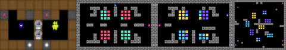

# Hypothetical-Minds: Scaffolding Theory of Mind for Multi-Agent Tasks with Large Language Models



## Overview
Hypothetical Minds is an autonomous LLM-based agent for diverse multi-agent settings, integrating a Theory of Mind module that scaffolds the high-level planning process by generating, evaluating, and refining hypotheses about other agents’ strategies in natural language.

## Installation
Install **MeltingPot** in editable mode from `https://github.com/locross93/meltingpot`, then install this repo
```
pip install -e .
```

## Running Hypothetical Minds and Baselines

To run an episode of Hypothetical Minds, use main.py as in the following example with "Running With Scissors Repeated":

```bash
python main.py --substrate rws --scenario_num 0 --agent_type hm --llm_type gpt4
```

To loop through every scenario in a substrate, use run_scenarios.py as in the following example running the Reflexion baseline on "Collaborative Cooking Asymmetric":

```bash
python run_scenarios.py --agent reflexion --substrate cc --num_seeds 5
```

### Substrates

| Alias      | Description                                       |
|------------|---------------------------------------------------|
| `cc` | `collaborative_cooking__asymmetric` - In this environment, two players operate on opposite sides of a divided kitchen, where they must collaborate to efficiently prepare tomato soup, with each player specializing in tasks based on their proximity to resources. |
| `rws`      | `running_with_scissors_in_the_matrix__repeated` - A zero-sum competitive environment where two players navigate a map collecting resources represented as yellow (rock), purple (paper), or blue (scissors). Players can "zap" each other to initiate a rock-paper-scissors style interaction based on their collected resources, resulting in one player receiving a positive reward and the other a corresponding negative reward. |
| `rws_arena`| `running_with_scissors_in_the_matrix__arena` - An eight player extension of RWS, where the focal agent controls one player against a background population of 7 strategies. |
| `pd` | `prisoners_dilemma_in_the_matrix__repeated` - Agents navigate a map similar to RWS, where they collect resources that correspond to cooperation or defection, reflecting the choices in the iterated prisoner’s dilemma game.|